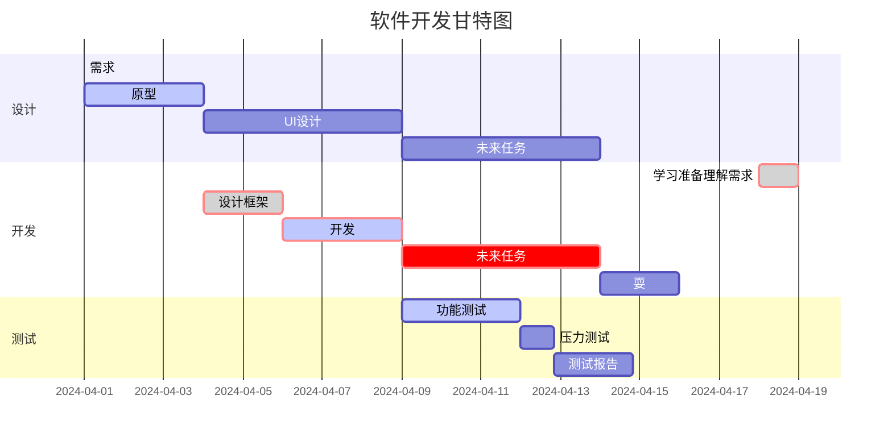

# *Welcome to Geng Zhicheng's blog*

***

`printf()` 函数
这是一个链接 [菜鸟教程](https://www.runoob.com)

这个链接用 1 作为网址变量 [Google][1]
这个链接用 runoob 作为网址变量 [Runoob][runoob]
然后在文档的结尾为变量赋值（网址）

  [1]: http://www.google.com/
  [runoob]: http://www.runoob.com/

<!-- 生产自己的浏览器链接 -->

